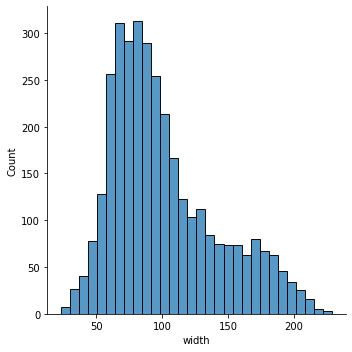
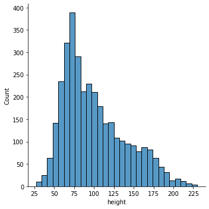
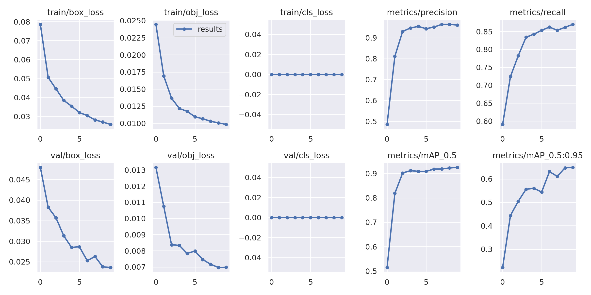
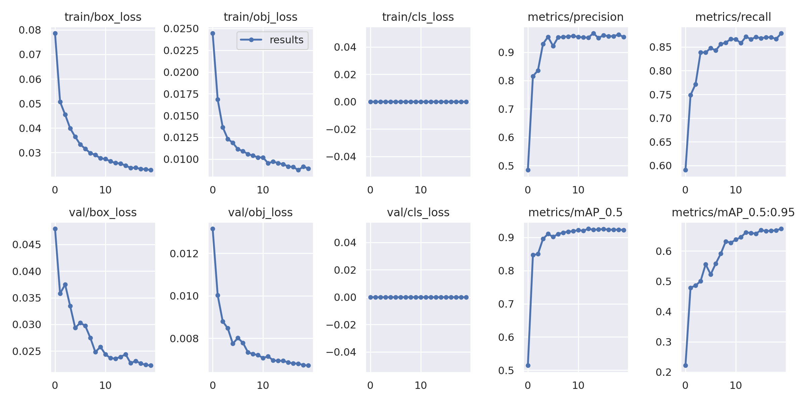
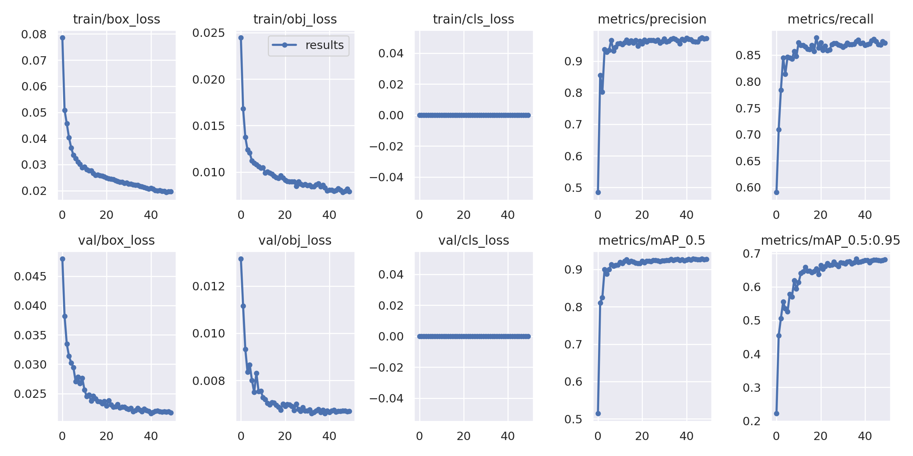

# Reconhecimento de Aeronaves a partir de Imagens de Sensoriameno Remoto usando Deep Learning

#### Aluno: [David Fernando Castillo Zúñiga](https://github.com/davidfer88).
#### Orientador: [Leonardo Forero Mendoza](https://github.com/leofome8).
---

Trabalho apresentado ao curso [BI MASTER](https://ica.puc-rio.ai/bi-master) como pré-requisito para conclusão de curso e obtenção de crédito na disciplina "Projetos de Sistemas Inteligentes de Apoio à Decisão".

- [Link para o código](https://github.com/davidfer88/TCC_BIMASTER). 

- Trabalhos relacionados: <!-- caso não aplicável, remover estas linhas -->
    - [Airbus Aircraft Detection](https://www.kaggle.com/datasets/airbusgeo/airbus-aircrafts-sample-dataset).
    

---

### Resumo

O reconhecimento de aeronaves a partir de imagens de sensoriamento remoto tem muitas aplicações na área civil e militar. A deteção dinâmica de aeronaves pode ser uma fonte importante para tomadas de decisão em estrategias militares ou de defesa. No campo civil é muito util a deteção de aeronaves para determinar o nivel de congestionamento de um aeroporto ou para verificar a disponibilidades de aeronaves em uma região em caso de emergencia.

Neste trabalho é feita uma análise exploratoria do conjunto de dados de detecçao de aeronaves da Airbus. Posterioremente é criado, treinado e validado um modelo de rede neural convolucional usando Yolov5. È realizado um estudo paramêtrico a fim de determinar a influência de alguns hiperparâmetros como épocas no desempenho dosmodelos criados.

### Abstract <!-- Opcional! Caso não aplicável, remover esta seção -->

Aircraft recognition from remote sensing images has many civil and military applications. The dynamic detection of aircraft can be an important source for decision making in military or defense strategies. In the civil field, aircraft detection is very useful to determine the level of congestion at an airport or to check the availability of aircraft in a region in case of emergency.

In this work, an exploratory analysis of the Airbus aircraft detection dataset is performed. Subsequently, a convolutional neural network model is created, trained and validated using Yolov5. A parametric study is carried out in order to determine the influence of some hyperparameters such as epochs on the performance of the created models.

### Introdução

Nos últimos anos, os detectores de objetos baseados em Rede Neural Convolucional (CNN) tem sido objeto de pesquisa devido à sua capacidade de calcular automaticamente recursos de imagens contextuais complexas. Podem-se classificar os métodos atuais de detecção de objetos baseados em CNN em detectores de dois estágios baseados em região ou detectores de estágio único baseados em regressão. Exemplos de detectores baseados em região incluem CNN baseado em região (RCNN), Fast RCNN e Faster RCNN, enquanto detectores como You Only Look Once (YOLO) e Single Shot MultiBox Detection (SSD) são exemplos de detectores baseados em regressão. Os modelos baseados em regressão são geralmente menos precisos em comparação com os detectores baseados em região, no entanto, os detectores baseados em regressão são significativamente mais rápidos em comparação com os detectores baseados em região. Esforços têm sido feitos por pesquisadores para desenvolver novos modelos baseados em CNN para melhorar o desempenho e a eficiência.

No contexto aeronáutico, o uso de detectores tem sido usado também como ferramenta de diagnóstico e de monitoramento de saúde superficial e estrutural de diferentes componentes aeronáuticos. Dei et al (2020) selecionaram a rede neural YOLO para fazer o reconhecimento automático de defeitos de corrosão e fadiga na superfície das aeronaves. Foram estabelecidos comparados entre si os modelos de detecção de defeitos de superfície de aeronaves baseados na rede neural YOLO e no Faster-RCNN. Visando os problemas de baixa eficiência e baixa precisão em métodos convencionais de detecção de defeitos de superfície para componentes de motores aeronáuticos, Liet al (2022) propuseram um modelo de detecção de defeitos de superfície baseado em um algoritmo de detecção de objetos YOLOv5 aprimorado.

O uso de YOLOV para detecção de objetos a partir de imagens de satélites também aplica a outro tipo de veículos. Ammart et. al. (2021) abordaram o problema de detecção de carros a partir de imagens aéreas usando Redes Neurais Convolucionais (CNNs). Eles avaliaram o desempenho de três algoritmos CNN de última geração, a saber, Faster R-CNN, bem como YOLOv3 e YOLOv4.

Neste trabalho é feita uma prova de conceito de análise exploratória e de detecção de conjunto de dados de aeronaves da Airbus usando Yolov5. Será avaliada a influência da variação de alguns hiperparâmetros como épocas e batch_size no desempenho dos modelos. 

Este trabalho será dividido nas seguintes seções: metodologia, resultados e  conclusão. Na seção metodologia são descritos a base de dados, o modelo de aprendizado profundo e os parâmetros para treinamento do modelo. Na seção resultados são apresentadas as métricas que serão utilizadas para avaliar os resultados e na sequência são apresentados os resultados para variação de diferentes hiperparâmetros. Na última seção são apresentadas as conclusões e trabalhos futuros sugeridos.

### Metodologia

#### Base de dados

Neste trabalho é utilizado como conjunto de dados de entrada o dataset de demonstração de detecção de aeronaves Airbus. Este conjunto de dados é uma versão de demonstração de conjuntos de dados de aprendizado profundo maiores e mais avançados criados a partir de imagens de satélite da Airbus. [Airbus Defense and Space Intelligence](https://www.intelligence-airbusds.com/) opera a maior constelação comercial de satélites combinando imagens ópticas de Pléiades, SPOT, Vision-1 e DMC, bem como a constelação de radar (composta por TerraSAR -X, TanDEM-X e PAZ). [OneAtlas](https://oneatlas.airbus.com/) oferece acesso fácil e flexível a imagens de satélite premium da Airbus, análises geoespaciais inovadoras, insights específicos do setor e muito mais.

##### Imagens para treinamento

A pasta `images`  contém 103 extratos de imagens das Plêiades com aproximadamente 50 cm de resolução. Cada imagem é armazenada como um arquivo JPEG de tamanho 2560 x 2560 pixels (ou seja, 1280 metros no solo). Os locais são vários aeroportos em todo o mundo. Alguns aeroportos aparecem várias vezes em diferentes datas de aquisição. Algumas imagens também incluem neblina ou nuvem para diversidade.

Seguem algumas imagens do conjunto de treinamento:

 

#### Formato de de dados COCO e Pascal VOC para detecção de objetos.

Uma das tarefas mais importantes em visão computacional é rotular os dados (Khandelwa, 2019). Existem várias ferramentas disponíveis onde podem-se carregar as imagens, rotular os objetos usando segmentação por instância. Isso ajuda na localização precisa do objeto usando caixas delimitadoras ou mascaramento usando polígonos. Essas informações são armazenadas em arquivos de anotação. Arquivos/arquivos de anotação podem estar nos formatos de dados [COCO](http://host.robots.ox.ac.uk/pascal/VOC/voc2012/devkit_doc.pdf) (Everingham, 2012) ou [Pascal VOC](https://arxiv.org/pdf/1405.0312.pdf) (Lin,2014).

##### Anotações

Todas as aeronaves foram anotadas com caixas delimitadoras nas imagens fornecidas. As anotações são fornecidas na forma de polígonos GeoJSON fechados. Um arquivo CSV chamado `annotations.csv` fornece todas as anotações - uma anotação por linha com o nome de arquivo correspondente da imagem como `image_id` e a classe da anotação, principalmente `Aircraft` ou `Truncated_Aircraft` para aeronaves localizadas na fronteira de a imagem.

Segue figura com imagem na qual foram incorporadas as informações das caixas delimitadoras.

##### Análise exploratoria básica

A partir de uma análise exploratória básica é possível verificar algumas características do conjunto de imagens base: são rotuladas 3316 aeronaves completas (Airplane) e 109 aeronaves truncadas (Truncated_airplane), verifica-se também que número mínimo de aeronaves por imagens é 5 e número máximos de aeronaves em uma imagem do conjunto é 92.

Seguem figuras mostrando a distribuição da largura e altura das caixas delimitadoras que rotulam as aeronaves. Esses valores estão dados em metros [m] e são coerentes com dimensões comuns de diferentes aeronaves.

 

##### Imagens extras

Uma pasta chamada `extras` contém 6 imagens extras que não são anotadas, e que são usadas para testar um modelo em imagens novas - nunca vistas antes.

#### Modelo de aprendizado profundo usando YoloV5

YOLO um acrônimo para 'You only look once', é um algoritmo de detecção de objetos que divide imagens em um sistema de grade. Cada célula na grade é responsável por detectar objetos dentro de si. %%YOLO é um dos algoritmos de detecção de objetos mais famosos devido à sua velocidade e precisão. O código-fonte aberto está disponível no [GitHub](https://github.com/ultralytics/yolov5).

Na  arquitetura do YoloV5 destacam 3 componentes: a espinha dorsal (backbone), a cabeça (head) e a detecção (detection). A espinha dorsal é uma rede neural convolucional (CNN) que coleta e modela caraterísticas de imagem em diferentes granularidades. O YoloV5 implementa o gargalo (Bottleneck ) de previsão de centro e escala (CSP) para formular recursos de imagem. A cabeça é uma série de camadas para combinar caraterísticas (features) de imagem para lançá-los em um processo de previsão. O YoloV5 também implementa o PA-NET para agregação de caraterísticas. A detecção é um processo que utiliza recursos do cabeça (head) e realiza etapas de previsão de caixa e classe (Ieamsaard, 2021). Um diagrama da arquitetura YoloV5 é mostrado na seguinte figura.

#### Treinamento do modelo

As imagens do conjunto de dados de entrada são muito grandes para um correto aprendizado pelo YOLO. É necessario s subdividisão das imagens em imagens menores ou ladrilhos (tiles). Configuração base: são gerados blocos antecipadamente  com um tamanho setado em 512 pixels por 512 pixels. Para garantir que todas as aeronaves possam ser vistas pela rede na integra , é permitida uma sobreposição de 64 pixels entre os blocos.É setada uma porcentangem de truncamento de 0.3. Para a base de treino foram setados os seguintes parâmetros: epochs=10, batch_size=16, imgsz=512.

Neste trabalho serão variados os anteriores parametros e será avaliada a influência no desempenho dos modelos. Para o treinamento e inferências dos modelos é utilizado o COLAB no ambiente de execução com GPU. 

### Resultados obtidos

#### Metricas 

As seguintes metricas foram usadas para avaliar o resultados: 

Perdad de caixa delimitadora (loss_bbox): uma perda que mede o quão "apertadas" as caixas delimitadoras previstas são para o objeto de verdade básica (geralmente uma perda de regressão, L1, smoothL1etc.).

Perda de classificação (loss_cls): uma perda que mede a exatidão da classificação de cada caixa delimitadora prevista: cada caixa pode conter uma classe de objeto ou um "background". Essa perda é geralmente chamada de perda de entropia cruzada.

Precisão: é uma medida de quando "" seu modelo prevê com que frequência ele prevê corretamente ?"" Indica o quanto podemos confiar nas previsões positivas do modelo.

Recall: é uma medida de "" seu modelo previu todas as vezes que deveria ter previsto? "" Indica quaisquer previsões que não deveriam ter sido perdidas se o modelo estiver ausente. 

Precisão Média Média (mAP). O mAP é usado como uma métrica padrão para analizar a precisão de um modelo de deteção de objetos.  O calculo de mAP é baseada nas seguintes submétricas: matriz de confusão, Interseção sobre a União (IoU), recall e precisão. The mAP incorpora um compromisso entre precisão e recall e considera tanto falsos positivos, como falsos negativos. Os verdadeiros e falsos positivos da tarefa de detecção de objetos são classificados usando o limite IoU.

Para acompanhamento das metricas do trinamento e validação é utilizado o  Wandb. WandB é um dashboard central para acompanhar  hiperparâmetros, métricas do sistema e previsões permitindo comparar modelos ao vivo.

#### Variação do número de épocas (epochs)

São apresentadas na seguinte figura as métricas de treinamento e validação para 10 épocas. Observa-se para o treinamento que a perda de caixa e a perda de objetividade decrescem expressivamente até a cuarta época e depois continuam em decrecimento menos acelerado sem chegar em um platô. A perda de classificaçao permanece em zero durante todo o treinamento. para a validação a perda de caixa e a perda de objetividade decrescem apresentando ligeiras oscilações. A perda de classificaçao permanece em zero também para os datos de validação. A precisão do modelo cresce consistentemente até a segunda época e depois continua com caearateristicas de platê, com ligeiras oscilações e leve tendencia cresecente. A curva de re recordação cresce expressivamente até terceira época e depois continua em crescimento menos acentuado, com ligeiras oscilações sem chegar a caraterizar um platô. A curva de precisão média para limite de IoU de 0.5 tem comportamento similar a curva de precisão com menores oscilações na parte com carateristicas de platô e ainda com ligeira tedência de leve crescimento.  A curva de precisão média para limite de IoU entre 0.5 e 0.95 apresnta um crescimento com fortes oscilações até a última época.

Métricas de treinamento e validação para 10 épocas

São apresentadas na seguinte figura as métricas de treinamento e validação para 20 épocas. Nas curvas de perda observa-se um comportamento semelhante ao apontado para as curvas de perda de 10 épocas, obervando-se maores oscilações nas  nas curvas de perda dos dados de validação. As curvas de precisão e precisão média para limite de IoU de 0.5 crescen consistentemente com algumas oscilações até sexta época e depois apresentam carateristicas de platô. A curva de recordação tem comportamento similar às curvas de precisão, mas não chega a ter uma região de platô tão consolidada, tendo ainda uma leve tendencia crescente. A curva de precisão média para limite de IoU entre 0.5 e 0.95 apresnta um crescimento expresivo com oscilações até a  época dez e depois continua crescendo de forma menos acentuada.   

Métricas de treinamento e validação para 20 épocas

São apresentadas na seguinte figura as métricas de treinamento e validação para 50 épocas. Nas curvas de perda para os dados de treinamento e validação observa-se uma carateristica de cotovelo  a partir da época 10, onde a tendncia de consolidação do platô é mais evidente para os dados de validação. As curvas de precisão e precisão média para limite de IoU de 0.5 crescen consistentemente com algumas oscilações até sexta época e depois apresentam carateristicas de platô. A curva de recordação tem comportamento similar às curvas de precisão, mas a consolidação sa região de platô aparece consolidada um pouco mais tarde depois da época 10. A curva de precisão média para limite de IoU entre 0.5 e 0.95 apresnta um crescimento expresivo com oscilações até a  época vinte e depois continua com uma região de convergencia/platô com ligeira tendencia crescente.

Métricas de treinamento e validação para 50 épocas

Na seguinte tabela são sumarizados os melhores valores para as diferentes métricas apresentadas nas figuras anteriores para 10, 20 e 50 épocas. Destaca que a melhor época para as diferentes rodadas foram a 9, a 20 e a 36 respectivamente. Como era de se esperar, geralmente para uma determinada métrica a o valor de melhor desempenho está associado ao treinamento de 50 épocas que teve o melhor ponto na época 36. Verificou-se que com o aumento de número de épocas obteve-se um aumento de desempenho, porem que é importante ter um critério de parada para eficiência computacional, já que a melhor época não necessariamente correspondera a última época do treinamento.

|Epoch	|10	|20	|50	|min	|max|
|---|---|---|---|---|---|
|time(hours)|0.182	|0.357|0.876	|0.182	|0.876|
|best/epoch	|9	|19	|36	|	||
|best/mAP_0.5	|0.92437	|0.92197	|0.9272	|0.92197	|0.9272|
|best/mAP_0.5:0.95	|0.6488	|0.67335	|0.68355	|0.6488	|0.68355|
|best/precision	|0.96137	|0.95388	|0.96394	|0.95388	|0.96394|
|best/recall	|0.8699	|0.87897	|0.87594	|0.8699	|0.87897|
|metrics/mAP_0.5	|0.92422	|0.92199	|0.92718	|0.92199	|0.92718|
|metrics/mAP_0.5:0.95	|0.64839	|0.67332	|0.68319	|0.64839	|0.68319|
|metrics/precision	|0.96136	|0.9536	|0.96584	|0.9536	|0.96584|
|metrics/recall	|0.86958	|0.87868	|0.87218	|0.86958	|0.87868|
|train/box_loss	|0.02579	|0.02291	|0.01966	|0.01966	|0.02579|
|train/cls_loss	|0	|0	|0	|0	|0|
|train/obj_loss	|0.00982	|0.00891	|0.00789	|0.00789	|0.00982|
|val/box_loss	|0.02359	|0.02229	|0.02196	|0.02196	|0.02359|
|val/cls_loss	|0	|0	|0	|0	|0|
|val/obj_loss	|0.00698	|0.00671	|0.00665	|0.00665	|0.00698|
|x/lr0	|0.00208	|0.00109	|0.0005	|0.0005	|0.00208|
|x/lr1	|0.00208	|0.00109	|0.0005	|0.0005	|0.00208|
|x/lr2	|0.00208	|0.00109	|0.0005	|0.0005	|0.00208|

São apresentadas a continuação figuras com as inferências para 2, 10, 20 e 50 épocas respectivamente. Para proposito de comparação foi fixada a mesma imagem. Observa-se para a partir de 10 épocas a maioria das aeronaves são detectadas. Destaca-se que com o aumento das épocas o indice IoU nas detecções vai incrementando. Interessante observar que uma pequena aeronave que foi detectada no modelo de 10 épocas não aparece nas previsões dos modelos de 20 e 50 épocas. Este fato permite fazer lembrança da importância do compromisso entre precisão e recall. 

Infereência para 2 épocas ------------------------------------------- Inferência para 10 épocas

 

Inferência para 20 épocas (configuração base)------------------------------------------- Inferência para 50 épocas

 

#### Variação do número de batch_size

Na seguinte tabela são sumarizados os melhores valores das diferentes métricas paraos batch-size:  10, 20 e 50. Foi fixado um número de 20 épocas. Não se evidenciam alterações significativas das métricas desempenho em função do parâmetro batch. Também não foram observadas variações significativas no tempo de treinamento dos modelos.

|Batch	|16	|32	|48	|64	|min|max|
|---|---|---|---|---|---|---|
|time(hours)|0.357	|0.360|0.359|0.353|0.353|0.360|
best/epoch	|	19	|	17	|	19	|	17	|		|		|
best/mAP_0.5	|	0.92197	|	0.92698	|	0.92083	|	0.92462	|	0.92197	|	0.92462	|
best/mAP_0.5:0.95	|	0.67335	|	0.67773	|	0.67508	|	0.67465	|	0.67335	|	0.67465	|
best/precision	|	0.95388	|	0.95788	|	0.97052	|	0.95102	|	0.95102	|	0.95388	|
best/recall	|	0.87897	|	0.87297	|	0.8684	|	0.87826	|	0.87826	|	0.87897	|
metrics/mAP_0.5	|	0.92199	|	0.92695	|	0.92087	|	0.92427	|	0.92199	|	0.92427	|
metrics/mAP_0.5:0.95	|	0.67332	|	0.67736	|	0.67488	|	0.67457	|	0.67332	|	0.67457	|
metrics/precision	|	0.9536	|	0.95786	|	0.97052	|	0.95101	|	0.95101	|	0.9536	|
metrics/recall	|	0.87868	|	0.8732	|	0.8684	|	0.8782	|	0.8782	|	0.87868	|
train/box_loss	|	0.02291	|	0.02277	|	0.02235	|	0.0226	|	0.0226	|	0.02291	|
train/cls_loss	|	0	|	0	|	0	|	0	|	0	|	0	|
train/obj_loss	|	0.00891	|	0.00888	|	0.00893	|	0.00882	|	0.00882	|	0.00891	|
val/box_loss	|	0.02229	|	0.02241	|	0.02213	|	0.02263	|	0.02229	|	0.02263	|
val/cls_loss	|	0	|	0	|	0	|	0	|	0	|	0	|
val/obj_loss	|	0.00671	|	0.00676	|	0.00674	|	0.0069	|	0.00671	|	0.0069	|
x/lr0	|	0.00109	|	0.00109	|	0.00109	|	0.00109	|	0.00109	|	0.00109	|
x/lr1	|	0.00109	|	0.00109	|	0.00109	|	0.00109	|	0.00109	|	0.00109	|
x/lr2	|	0.00109	|	0.00110	|	0.00109	|	0.00109	|	0.00109	|	0.00109	|

São apresentadas a continuação figuras para seguinte conjunto de valores do parametro batch_size: 16, 32, 48 e 64. Para proposito de comparação foi fixada a mesma imagem. 

Inferência para batch_size = 16 (configuração base) -------------------------------------------- Inferência para batch_size = 32 

 

Inferência para batch_size = 48 -------------------------------------------- Inferência para batch _size = 64 

 

#### Variação do parametro TILE_OVERLAP

Na seguinte tabela são sumarizados os melhores valores das diferentes métricas para seguinte conjunto de valores do parâmetro de sobreposição de ladrilho (TILE_OVERLAP):  0, 32, 64 e 128. Foi fixado um número de 20 épocas. Observa-se que não á uma tendencia clara no tempo de treinamento, sendo observado aproximadamente o dobro do tempo de treinamento para cuando o parâmetro tile_overlap é nulo ou quando é setado em 128 pixels em comparação com tempo de treinamento para valores setados em .32 e 64 pixels. Não se observa uma variação significativa nas métricas de desempenho em função da variação do parâmetro tile_overlap, mas eveidencia ma leve tendencia de degradação na maioria das métricas para os dois casos extremos. 

|	TILE_OVERLAP (Pixels)	|	0	|	32	|	64	|	128	|	min	|	max	|
|	---	|	---	|	---	|	---	|	---	|	---	|	---	|
|	time (hours)	|	0.633	|	0.377	|	0.357	|	0.653	|		0.357|	0.653	|
|	best/epoch	|	18	|	19	|	19	|	18	|		|		|
|	best/mAP_0.5	|	0.91922	|	0.92105	|	0.92197	|	0.91999	|	0.91922	|	0.92197	|
|	best/mAP_0.5:0.95	|	0.68888	|	0.67555	|	0.67335	|	0.68318	|	0.67335	|	0.68888	|
|	best/precision	|	0.94331	|	0.96849	|	0.95388	|	0.93472	|	0.93472	|	0.96849	|
|	best/recall	|	0.84347	|	0.86131	|	0.87897	|	0.8487	|	0.84347	|	0.87897	|
|	metrics/mAP_0.5	|	0.9192	|	0.92109	|	0.92199	|	0.91995	|	0.9192	|	0.92199	|
|	metrics/mAP_0.5:0.95	|	0.68881	|	0.67611	|	0.67332	|	0.6832	|	0.67332	|	0.68881	|
|	metrics/precision	|	0.94353	|	0.96846	|	0.9536	|	0.93473	|	0.93473	|	0.96846	|
|	metrics/recall	|	0.84347	|	0.86131	|	0.87868	|	0.84883	|	0.84347	|	0.87868	|
|	train/box_loss	|	0.02124	|	0.02247	|	0.02291	|	0.02135	|	0.02124	|	0.02291	|
|	train/cls_loss	|	0	|	0	|	0	|	0	|	0	|	0	|
|	train/obj_loss	|	0.00811	|	0.00854	|	0.00891	|	0.00768	|	0.00768	|	0.00891	|
|	val/box_loss	|	0.02039	|	0.02244	|	0.02229	|	0.02061	|	0.02039	|	0.02244	|
|	val/cls_loss	|	0	|	0	|	0	|	0	|	0	|	0	|
|	val/obj_loss	|	0.00608	|	0.0063	|	0.00671	|	0.00607	|	0.00607	|	0.00671	|
|	x/lr0	|	0.00109	|	0.00109	|	0.00109	|	0.00109	|	0.00109	|	0.00109	|
|	x/lr1	|	0.00109	|	0.00109	|	0.00109	|	0.00109	|	0.00109	|	0.00109	|
|	x/lr2	|	0.00109	|	0.00109	|	0.00109	|	0.00109	|	0.00109	|	0.00109	|

São apresentadas a continuação figuras das inferêrencias para o seguinte conjunto de valores do parametro TILE_OVERLAP : 0, 32, 64 e 128 pixels. Para proposito de comparação foi fixada a mesma imagem. 

Inferência para TILE_OVERLAP  = 0 -------------------------------------------- Inferência para TILE_OVERLAP  = 32 

 

Inferência para TILE_OVERLAP  = 64 (configuração base) -------------------------------------------- Inferência para TILE_OVERLAP = 128

 

#### Variação do parâmetro TRUNCATED_PERCENT

Na seguinte tabela são sumarizados os melhores valores das diferentes métricas para o conjunto de valores do parametro de percentagem de truncamento (TRUNCATED_PERCENT):  0, 0.3, 0.6 e 0.9. Foi fixado um número de 20 épocas. Observa-se que em termos de tempo de treinamento não houve variações significativas entre os diferentes modelos. Para todos os modelos considerados a a melhor época sempre foi a número 19. De forma geral não se evidenciou influência da variação do parâmetro TRUNCATED_PERCENT nas diferentes métricas desempenho a exepção de cuando este este tem um valor nulo e observa-se um desempeno degradado para as métricas correspondentes à melhor época. 

|	TRUNCATED_PERCENT	|	0	|	0.3	|	0.6	|	0.9	| min	|	max	|
|	---	|	---	|	---	|	---	|	---	|	---	|	---	|
|	time (hours)	|	0.369	|	0.357	|	0.381	|	0.384	|	0.357	|	0.384	|
|	best/epoch	|	19	|	19	|	19	|	19	|		|		|
|	best/mAP_0.5	|	0.84363	|	0.92197	|	0.92234	|	0.92436	|	0.84363	|	0.92436	|
|	best/mAP_0.5:0.95	|	0.59515	|	0.67335	|	0.69155	|	0.69118	|	0.59515	|	0.69155	|
|	best/precision	|	0.96473	|	0.95388	|	0.94908	|	0.94062	|	0.94062	|	0.96473	|
|	best/recall	|	0.79547	|	0.87897	|	0.87676	|	0.87924	|	0.79547	|	0.87924	|
|	metrics/mAP_0.5	|	0.84343	|	0.92199	|	0.92232	|	0.92436	|	0.84343	|	0.92436	|
|	metrics/mAP_0.5:0.95	|	0.59493	|	0.67332	|	0.69141	|	0.69107	|	0.59493	|	0.69141	|
|	metrics/precision	|	0.96544	|	0.9536	|	0.94876	|	0.94065	|	0.94065	|	0.96544	|
|	metrics/recall	|	0.7953	|	0.87868	|	0.87676	|	0.87973	|	0.7953	|	0.87973	|
|	train/box_loss	|	0.02348	|	0.02291	|	0.02206	|	0.02183	|	0.02183	|	0.02348	|
|	train/cls_loss	|	0	|	0	|	0	|	0	|	0	|	0	|
|	train/obj_loss	|	0.01207	|	0.00891	|	0.0075	|	0.00717	|	0.00717	|	0.01207	|
|	val/box_loss	|	0.02384	|	0.02229	|	0.02052	|	0.02066	|	0.02052	|	0.02384	|
|	val/cls_loss	|	0	|	0	|	0	|	0	|	0	|	0	|
|	val/obj_loss	|	0.01049	|	0.00671	|	0.00487	|	0.005	|	0.00487	|	0.01049	|
|	x/lr0	|	0.00109	|	0.00109	|	0.00109	|	0.00109	|	0.00109	|	0.00109	|
|	x/lr1	|	0.00109	|	0.00109	|	0.00109	|	0.00109	|	0.00109	|	0.00109	|
|	x/lr2	|	0.00109	|	0.00109	|	0.00109	|	0.00109	|	0.00109	|	0.00109	|

São apresentadas a continuação figuras para seguinte conjunto de valores do parametro TRUNCATED_PERCENT: 0, 0.3, 0.6 e 0.9. Para proposito de comparação foi fixada a mesma imagem. 

Inferência para TRUNCATED_PERCENT = 0 -------------------------------- Inferência para TRUNCATED_PERCENT = 0.3 (configuração base)

 

Inferência para TRUNCATED_PERCENT = 0.6 -------------------------------- Inferência para TRUNCATED_PERCENT = 0.9

 

#### Variação dos parametros Tile_Width e Tile Heigth

Na seguinte tabela são sumarizados os melhores valores das diferentes métricas para os Tile_Width_Heigth  128, 256, 512 e 1024. Foi fixado um número de 20 épocas. Observa-se uma tendência de melhora de desemepenho com o aumento do tamanho das imagens. Não se verificou alterações significativas no tempo de treinamento.

|	TILE_WIDTH/HEIGTH (Pixels)	|	128	|	256	|	512	|	1024	|	min	|	max	|
|	---	|	---	|	---	|	---	|	---	|	---	|	---	|
|	time (hours)	|	0,359	|	0,334	|	0,353	|	0,350	|	0,334	|	0,359	|
|	best/epoch	|	18	|	19	|	19	|	18	|		|		|
|	best/mAP_0,5	|	0,88973	|	0,90626	|	0,92197	|	0,94203	|	0,88973	|	0,94203	|
|	best/mAP_0,5:0,95	|	0,58002	|	0,66397	|	0,67335	|	0,69823	|	0,58002	|	0,69823	|
|	best/precision	|	0,90495	|	0,95083	|	0,95388	|	0,98485	|	0,90495	|	0,98485	|
|	best/recall	|	0,84194	|	0,85983	|	0,87897	|	0,8991	|	0,84194	|	0,8991	|
|	metrics/mAP_0,5	|	0,89023	|	0,90629	|	0,92199	|	0,94199	|	0,89023	|	0,94199	|
|	metrics/mAP_0,5:0,95	|	0,58066	|	0,66471	|	0,67332	|	0,69829	|	0,58066	|	0,69829	|
|	metrics/precision	|	0,90487	|	0,95114	|	0,9536	|	0,98487	|	0,90487	|	0,98487	|
|	metrics/recall	|	0,84102	|	0,85889	|	0,87868	|	0,8991	|	0,84102	|	0,8991	|
|	train/box_loss	|	0,03022	|	0,02463	|	0,02291	|	0,02295	|	0,02291	|	0,03022	|
|	train/cls_loss	|	0	|	0	|	0	|	0	|	0	|	0	|
|	train/obj_loss	|	0,00282	|	0,00499	|	0,00891	|	0,03079	|	0,00282	|	0,03079	|
|	val/box_loss	|	0,02967	|	0,02185	|	0,02229	|	0,02177	|	0,02177	|	0,02967	|
|	val/cls_loss	|	0	|	0	|	0	|	0	|	0	|	0	|
|	val/obj_loss	|	0,00373	|	0,00443	|	0,00671	|	0,0264	|	0,00373	|	0,0264	|
|	x/lr0	|	0,00109	|	0,00109	|	0,00109	|	0,00109	|	0,00109	|	0,00109	|
|	x/lr1	|	0,00109	|	0,00109	|	0,00109	|	0,00109	|	0,00109	|	0,00109	|
|	x/lr2	|	0,00109	|	0,00109	|	0,00109	|	0,00109	|	0,00109	|	0,00109	|

São apresentadas a continuação figuras para seguinte conjunto de valores dos parametros TILE_WIDTH, TILE_HEIGTH,imgsz : 128, 256, 512 e 1024 pixels. O valor setado é o mesmo para os três parâmetros. Para proposito de comparação foi fixada a mesma imagem. Observa-se uma grande quantidade de falsos negativos pra 128 pixels. Para 256 pixels observam-se dois falsos negativos incluindo um aeronave relativamente grande. Para 512 e 1024 pixels observa-se um falso negativo de uma aeronave comparativamente pequena. É importante destacar que o desempenho nas inferências  ao modificar o tamaho das imagens não estará influenciado só por este parâmetro, como com as sua relação com outro parametro que foi deixado constante como a superposição (TILE_OVERLAP). Esse desbalanceamento pode ser uma das causa da baixa qualidade de inferência para 128 pixels.  

Inferência para TILE_WIDTH = 128  -------------------------------- Inferência para TILE_WIDTH = 256 

 

Inferência para TILE_WIDTH = 512  (configuração base)  --------------------------------                 Infereência para TILE_WIDTH = 1024

 

### Conclusão

Neste trabalho foi desenvolvido e estudado um modelo para deteção de aeronaves a partir de imagens remotas de sensoreamento. O modelo é treinado pelo YoloV5 em diferentes números épocas, batch size, tamanho de imagens, sobreposição de ladrilhos e percentagens de truncamento. En termos de tempo de treinamento os parametros que mais o inflenciam são o número de epocas que tem uma relação de proporcionalidade e a sobreposicionamento dos ladrilhos (TILE_OVERLAP). Com respeito à métricas de desempenho não se verificou influência significativa dos parametrôs batch_size, TILE_OVERLAP e TRUNCATED_PERCENT.  Observou-se uma tendencia de melhora geral nas métricas de de desempenho quando foi aumentado o número de épocas e o tamanho dos ladrilhos/imagens. As anteriores observações ficam limitadas a os intervalos e casos especificos testados, não sendo possivel ter uma generalização das tendências observadas. Do estudo verifica-se a necessidade de ao variar um  determinado paramêtro e deixar os outros inalterados, levar em conta que o desbalanceamento de relações entre eles também pode influenciar no desempenho do modelo.

Trabalhos futuros: No presente trabalho foi abordado o problema de deteção de uma classe, em futuros estudos pode ser abordado o problema de reconhecimento de diferentes tipos de aeronaves e/o de sbcomponentes da aeronave.  

### Referências

Ammar, A., Koubaa, A., Ahmed, M., Saad, A., & Benjdira, B. (2021). Vehicle detection from aerial images using deep learning: A comparative study. Electronics, 10(7), 820.

Deyin, Z., Penghui, W., Mingwei, T., Conghan, C., Li, W., & Wenxuan, H. (2020, December). Investigation of Aircraft Surface Defects Detection Based on YOLO Neural Network. In 2020 7th International Conference on Information Science and Control Engineering (ICISCE) (pp. 781-785). IEEE.
Everingham, M., & Winn, J. (2012). The PASCAL visual object classes challenge 2012 (VOC2012) development kit. Pattern Anal. Stat. Model. Comput. Learn., Tech. Rep, 2007, 1-45.

Ieamsaard, J., Charoensook, S. N., & Yammen, S. (2021, March). Deep learning-based face mask detection using yolov5. In 2021 9th International Electrical Engineering Congress (iEECON) (pp. 428-431). IEEE.

Kasper-Eulaers, M., Hahn, N., Berger, S., Sebulonsen, T., Myrland, Ø., & Kummervold, P. E. (2021). Detecting heavy goods vehicles in rest areas in winter conditions using YOLOv5. Algorithms, 14(4), 114.

Khandelwa, R. (2019). COCO and Pascal VOC data format for Object detection. Towards Data Science. Available online: https://towardsdatascience. com/coco-data-format-for-object-detection-a4c5eaf518c5 (accessed on 17 September 2020).

Li, X.;Wang, C.; Ju, H.; Li, Z. Sc Appl. Sci. 2022, 12, 7235. https://doi.org/10.3390/app12147235

Lin, T. Y., Maire, M., Belongie, S., Hays, J., Perona, P., Ramanan, D., ... & Zitnick, C. L. (2014, September). Microsoft coco: Common objects in context. In European conference on computer vision (pp. 740-755). Springer, Cham.

Wu, Z. Z., Wan, S. H., Wang, X. F., Tan, M., Zou, L., Li, X. L., & Chen, Y. (2020). A benchmark data set for aircraft type recognition from remote sensing images. Applied Soft Computing, 89, 106132.

Zhao, A., Fu, K., Wang, S., Zuo, J., Zhang, Y., Hu, Y., & Wang, H. (2017). Aircraft recognition based on landmark detection in remote sensing images. IEEE Geoscience and Remote Sensing Letters, 14(8), 1413-1417.

---

Matrícula: 202.100.173

Pontifícia Universidade Católica do Rio de Janeiro

Curso de Pós Graduação *Business Intelligence Master*
